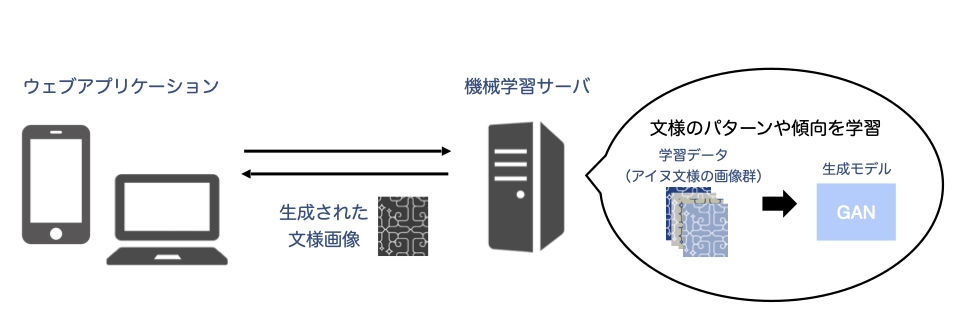
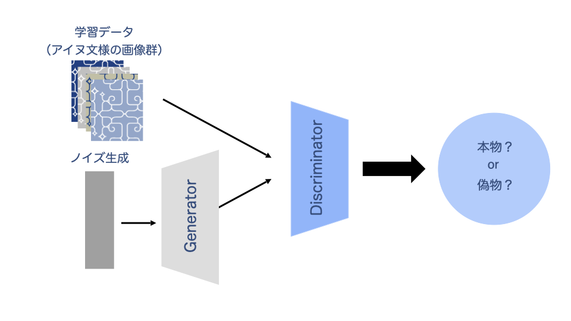

# 文様メーカー（アイヌ文様xTech)

## 製品概要
　私たちのアプリケーションでは、博物館に収蔵されているアイヌの木綿衣の文様を機械学習することで、アプリケーション内でオリジナルの文様を自動生成できるようにしました。
### 背景(製品開発のきっかけ、課題等）
**普段展示していない博物館資料から、「アイヌ文化」について学ぶきっかけを作りたい。**  

　北海道は古来よりアイヌという先住民族が住んできた土地であり、日本の中でもアイヌ文化に親しみが湧きやすい地域です。しかし歴史的背景からアイヌ文化を熟知している人の数が限られていることもあり、北海道に在住している場合でも、非アイヌの人々にとってアイヌ文化を理解することはいまだハードルが高い状態が続いています。多民族が共生するためには、お互いの文化を理解することが不可欠です。そこで**アイヌの文化を学ぶ間口を広げるために、学習のきっかけとなるようなアプリケーションの開発が必要**であると考えました。  
　また、北海道の博物館にはアイヌの資料が多く収蔵されていますが、展示スペースや資料保存の観点から日常的にアクセス可能な数が限られています。せっかく残されているのに、もったいない。この**博物館の資料をアプリケーション開発に活用することで、アイヌのための資料活用にも繋がる**と考えました。  
　ここで、アイヌ政策に関する世論調査において、アイヌを知っていると答えた一般の市民の中で、最も認知度が高いものはアイヌ文様であるという報告がされています[1]。また、文化の継承を目的として機械学習技術を用いたアイヌ語の自動音声認識・合成技術の開発も行われています[2]。そこで、私たちはこれらの報告に着目して、**アイヌ文様を機械学習してオリジナルの文様画像を自動で生成するアプリケーションの開発**を試みます。
### 製品説明（具体的な製品の説明）
　開発したアプリケーションでは、まず、実際のアイヌ文様の画像ファイルを計算機に取り込み、機械学習手法の一つである敵対的生成ネットワーク（以降、生成モデル）を用いてアイヌ文様のパターンや法則性等を学習します。その後、学習を行った生成モデルに基づきオリジナルの文様画像を自動で生成します。
### システム構成図

### 特長
- アイヌ文様を学習した生成モデルからオリジナルの文様画像を生成可能
- 一度に異なるパターンの画像を複数生成可能
- WEBアプリケーションベースなので手軽にオリジナル文様を生成することが可能
- 機械学習での画像生成ページに加えて、実際の木綿衣がもつ、陰影や立体的なデザインを紹介するページも充実

### 実現・解決出来ること
- アイヌ文様に関する知識に触れることで、アイヌ文化へ興味を持つきっかけとなる
- アイヌを始めとした他民族理解への第一歩となる
- 博物館に収蔵されているアイヌの資料の活用方法を増やすことができる
### 今後の展望
- 生成モデルのパラメータの調整による高画質化
- 模様生成モデルと服の構成色生成モデルを統合した衣服のデザイン機能の実装
- アイヌ文化に関する学びのきっかけとなる文化体験だけでなく、アイヌと非アイヌが人と人として対話し、継続的に学びを得るための情報および機能の追加
- 文様種類の属性情報を用いた教師あり生成モデルの構築
### 注力したこと（こだわり等）
* アイヌ文化や歴史的背景について書籍、公開講座より勉強および専門家にインタビューし、実際の資料を元に機械学習したこと
* レスポンシブデザイン
* 文様画像をカラーとグレーの2種類で生成可能としたこと
* 文様の特徴を抽出するために、カラー画像やグレー画像また、様々な生成モデルを用いて学習を行ったこと

## 開発技術
### 活用した技術
#### API・データ
* アイヌの衣服画像（木綿衣） *1

#### フレームワーク・ライブラリ・モジュール
* Adobe XD
* Virtual Box (仮想環境ツール)
* Vagrant (仮想環境ツール)
* Flask (Python用 ウェブアプリケーションフレームワーク)
* PyTorch (Pythonの機械学習ライブラリ)
* Google Colaboratory  (Googleの機械学習ライブラリ)
* Bootstrap (フロントエンドWebアプリケーションフレームワーク)
* jQuery (フロントエンドJavascriptライブラリ-アニメーション全般)
* Galleriffic(フロントエンドJavascriptライブラリ-画像一覧表示)
* Deep Convolutional GAN [3]やConditional Style GAN [4] (敵対的生成ネットワーク)
 
#### デバイス
* なし

### 独自技術
#### ハッカソンで開発した独自機能・技術
* トップページのロゴなどのオリジナルデザイン
* JavascriptライブラリjQueryを用いることで動的でモダンなサイトを構築した
* Pythonライブラリopencvを使用したアイヌの衣服の写真から輝度に基づいて自動で文様部分をトリミングするコード
* Flaskを用いた生成モデルの学習・テストフェーズの実装
* 乱数を用いて生成モデルから出力される画像をランダムにしたこと
* 実際の木綿衣のデザインページや実際のアイヌ文化を紹介するWebページリンクを追加することで、アイヌ文化を学習しやすいサイト構成にした

## アイヌの衣服資料と学習モデルについて
　本プロジェクトではご提供いただいたアイヌの衣服資料（資料素材を用いた「アイヌ文様の魅力」ページを含む）は、提供規則の観点より非公開としております。また、ご提供いただいた画像を用いた画像生成モデルの学習に関するパラメータのファイルも同様に非公開としております。

## 注意事項
* アイヌ文様には文化的な背景があり、家族で受け継がれる説や、地域ごとの特徴があるといわれておりますが、各文様の意味合いについては完全に明らかとなっておりません [5]。
* 本プロジェクトでは、アイヌ衣服に刺しゅうされた、モレウ（渦巻き文）やアイウシ（括弧文）等の特徴を機械学習しています。このため、生成された画像には刺しゅう模様に似たパターンが含まれております。しかし、今回生成された画像は、あくまで博物館に収蔵されている資料から得られた画像を学習して得られるものであり、実際のアイヌ文様とは異なります。

## *1 資料提供について
　アイヌの衣服資料画像を以下の機関よりご提供いただきました。お忙しい中ご対応いただきありがとうございます。
* 北海道大学 北方生物圏フィールド科学センター 耕地圏ステーション 植物園 助教 加藤 克　様
* 北海道博物館様

## 謝辞

## 参考文献
[1] 情報出典「アイヌ政策に関する世論調査」の概要, p. 10, 2018.
https://survey.gov-online.go.jp/tokubetu/h30/h30-ainug.pdf

[2] アイヌ語の自動音声認識・合成（AINU語AI）, 2020.
https://www.kyoto-u.ac.jp/ja/research/research_results/2020/201012_2.html

[3] Radford, Alec, Luke Metz, and Soumith Chintala. "Unsupervised representation learning with deep convolutional generative adversarial networks," arXiv preprint arXiv:1511.06434, 2015.

[4] Oeldorf, Cedric, and Gerasimos Spanakis. "LoGANv2: Conditional Style-Based Logo Generation with Generative Adversarial Networks," 18th IEEE International Conference on Machine Learning And Applications (ICMLA), 2019.

[5] 北原次郎太, "アイヌ文様は「魔除け」か―衣文化に付随する通説を検証する," 北海道博物館アイヌ民族文化研究センター研究紀要, vol. 3, pp. 1-8, 2018.

アイヌ文様フリー素材モレウ（素材利用）
https://ainu-monyou.com/rule
